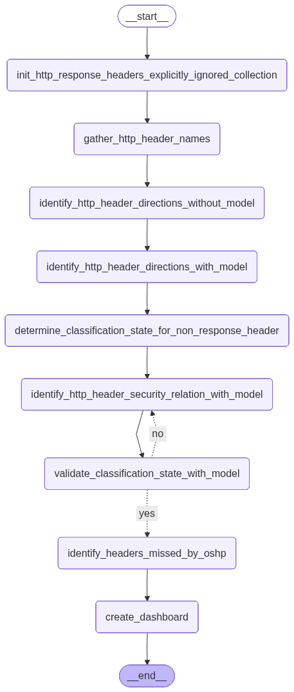
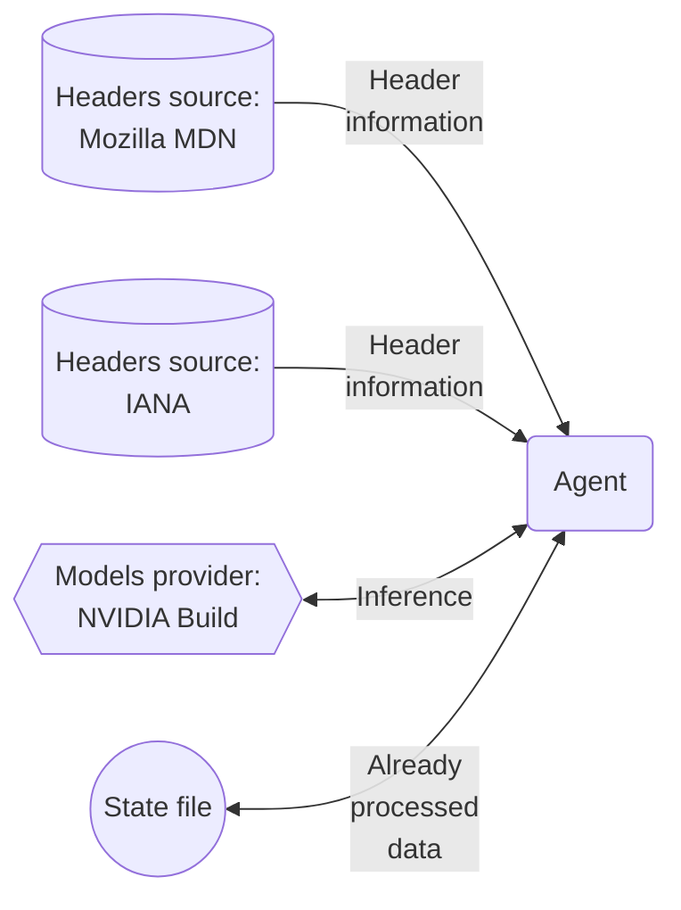

[](https://github.com/righettod/oshp-headers-discovery/actions/workflows/update_dashboard.yml)   

# Description

🎯 This project is an AI agent for [OSHP](https://github.com/OWASP/www-project-secure-headers/) that tries to find any *HTTP response security header* that OSHP missed and that should be investigated for potential adding.

# Flow

🤖 The following schema show the flow followed by of the agent:



💡 The following schema shwo the data sources and models provider used:



# Agent pattern recommendation by Claude

```text
Given your goals (simple, educational, linear pipeline with an LLM validation step), the right pattern is a Sequential Pipeline Agent,
sometimes called a "Chain of Thought Pipeline" or just a multi-step chain.

Each step has a single responsibility and passes its output to the next step.
The only "agentic" decision point is the LLM filter + LLM validator pair.

[Data Fetcher] → [Header Merger] → [Direction Classifier] → [LLM Filter] → 
[LLM Validator] → [OSHP Diff] → [Report]
```

# Dashboard

📊 The file [dashboard.md](dashboard.md) contains the result of the processing that must be reviewed to missing headers.

# Ignored headers and reason

> [!IMPORTANT]
> Ignoring is not definitive, a header can be considered I made a mistake in understanding its purpose.

> [!NOTE]
> I used Claude to help me to understand and identify the purpose of a header and if it fit the selection criteria.

🤔 Selection criteria:

1. I consider header that, when added, enable a protection in the browser that prevent an security issue or make exploitation harder.
2. I do not keep header that require the app to implements specific features.

<!--IGNORED_HEADERS_SECTION_START-->

| Header name                         | Reason                                                                                                                                                                                                                                                                                              |
| ----------------------------------- | --------------------------------------------------------------------------------------------------------------------------------------------------------------------------------------------------------------------------------------------------------------------------------------------------- |
| `PUBLIC-KEY-PINS`                   | Deprecated header.                                                                                                                                                                                                                                                                                  |
| `PUBLIC-KEY-PINS-REPORT-ONLY`       | Deprecated header.                                                                                                                                                                                                                                                                                  |
| `EXPECT-CT`                         | Deprecated header.                                                                                                                                                                                                                                                                                  |
| `ACCESS-CONTROL-ALLOW-CREDENTIALS`  | Header needed to be present to open exposure of a resource.                                                                                                                                                                                                                                         |
| `ACCESS-CONTROL-ALLOW-HEADERS`      | Header needed to be present to open exposure of a resource.                                                                                                                                                                                                                                         |
| `ACCESS-CONTROL-ALLOW-METHODS`      | Header needed to be present to open exposure of a resource.                                                                                                                                                                                                                                         |
| `ACCESS-CONTROL-ALLOW-ORIGIN`       | Header needed to be present to open exposure of a resource.                                                                                                                                                                                                                                         |
| `ACCESS-CONTROL-EXPOSE-HEADERS`     | Header needed to be present to open exposure of a resource.                                                                                                                                                                                                                                         |
| `ACCESS-CONTROL-MAX-AGE`            | Header needed to be present to open exposure of a resource.                                                                                                                                                                                                                                         |
| `ACCESS-CONTROL-REQUEST-HEADERS`    | Header needed to be present to open exposure of a resource.                                                                                                                                                                                                                                         |
| `ACCESS-CONTROL-REQUEST-METHOD`     | Header needed to be present to open exposure of a resource.                                                                                                                                                                                                                                         |
| `SET-COOKIE`                        | Set a cookie properties including its security aspect but its primary purpose is not enabling a security feature of the browser.                                                                                                                                                                    |
| `SET-COOKIE2`                       | Set a cookie properties including its security aspect but its primary purpose is not enabling a security feature of the browser.                                                                                                                                                                    |
| `ACCESS-CONTROL`                    | Replaced by CORS.                                                                                                                                                                                                                                                                                   |
| `ACTIVATE-STORAGE-ACCESS`           | Enable access to unpartitioned cookies that are blocked by default in cross-site context. Not specifying it means the browser's default blocking remains in effect - the header is a recovery mechanism, not a security gate.                                                                       |
| `AUTHENTICATION-INFO`               | Header used to carry authentication-related data back to the client after a successful request.                                                                                                                                                                                                     |
| `CONTENT-DIGEST`                    | Header used to verify the integrity of a message body. It provides a cryptographic hash of the content, allowing the recipient to confirm the data wasn't corrupted or tampered with in transit.                                                                                                    |
| `DPOP`                              | HTTP security mechanism that binds an access token to a specific client's key pair, preventing stolen tokens from being used by an attacker. Require the web app to support DPOP in the access token content and verification. It's an application-level protocol.                                  |
| `HOBAREG`                           | HTTP Origin-Bound Authentication, a password-free authentication scheme based on digital signatures and public-key cryptography. It's an application-level protocol.                                                                                                                                |
| `INCLUDE-REFERRED-TOKEN-BINDING-ID` | Token Binding never achieved wide adoption. Chrome removed support around 2021, and it's largely considered a deprecated technology today.                                                                                                                                                          |
| `PROXY-AUTHENTICATE`                | It's a proxy authentication mechanism, not a browser security feature. It tells clients that authentication is required to use a proxy, which has nothing to do with preventing security issues or hardening exploitation in the browser.                                                           |
| `SET-LOGIN`                         | The header is part of the Federated Credential Management (FedCM) API. It signals to the browser whether the user is logged in or not.                                                                                                                                                              |
| `SIGNATURE`                         | The header requires the application to implement specific features. It provides no browser-enforced protection on its own. It's an application-level integrity mechanism, not a passive browser security control.                                                                                   |
| `SPECULATION-RULES`                 | The header is used to hint to the browser which pages to prefetch or prerender for performance purposes. It doesn't enable any security protection or make exploitation harder.                                                                                                                     |
| `WWW-AUTHENTICATE`                  | The header that tells clients how to authenticate.                                                                                                                                                                                                                                                  |
| `SEC-PRIVATE-STATE-TOKEN`           | The header (part of the Private State Tokens API, formerly Trust Tokens) requires the application to implement specific features - namely, the token issuance and redemption infrastructure. The server must actively participate in the protocol by operating as a token issuer or relying on one. |
| `SEC-PRIVATE-STATE-TOKEN-LIFETIME`  | Same like for **SEC-PRIVATE-STATE-TOKEN**.                                                                                                                                                                                                                                                          |

<!--IGNORED_HEADERS_SECTION_END-->
