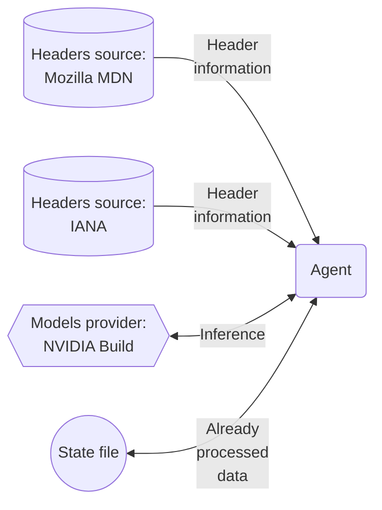

[](https://github.com/righettod/oshp-headers-discovery/actions/workflows/update_dashboard.yml)   

# Description

🎯 This project is an AI agent for [OSHP](https://github.com/OWASP/www-project-secure-headers/) that tries to find any *HTTP response security header* that OSHP missed and that should be investigated for potential adding.

# Flow

🤖 The following schema show the flow followed by of the agent:


💡 The following schema shwo the data sources and models provider used:



# Dashboard

📊 The file [dashboard.md](dashboard.md) contains the result of the processing that must be reviewed to missing headers.

# Ignored headers and reason

| Header name                   | Reason                                                                                                                           |
| ----------------------------- | -------------------------------------------------------------------------------------------------------------------------------- |
| `PUBLIC-KEY-PINS`             | Deprecated header.                                                                                                               |
| `PUBLIC-KEY-PINS-REPORT-ONLY` | Deprecated header.                                                                                                               |
| `EXPECT-CT`                   | Deprecated header.                                                                                                               |
| `ACCESS-CONTROL-*`            | Header needed to be present to open exposure.                                                                                    |
| `SET-COOKIE`                  | Set a cookie properties including its security aspect but its primary purpose is not enabling a security feature of the browser. |

# Agent pattern recommendation by Claude

```text
Given your goals (simple, educational, linear pipeline with an LLM validation step), the right pattern is a Sequential Pipeline Agent,
sometimes called a "Chain of Thought Pipeline" or just a multi-step chain.

Each step has a single responsibility and passes its output to the next step.
The only "agentic" decision point is the LLM filter + LLM validator pair.

[Data Fetcher] → [Header Merger] → [Direction Classifier] → [LLM Filter] → 
[LLM Validator] → [OSHP Diff] → [Report]
```
